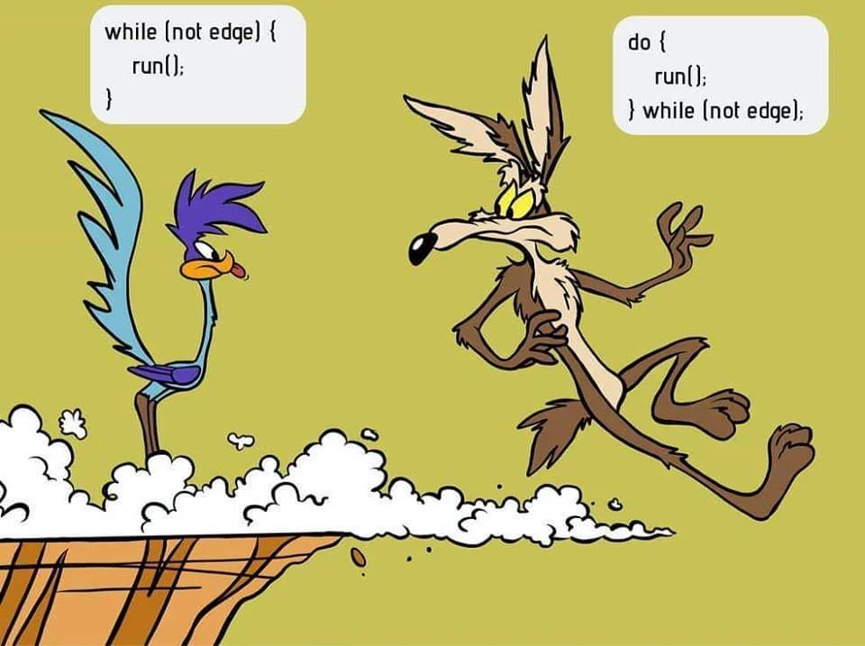
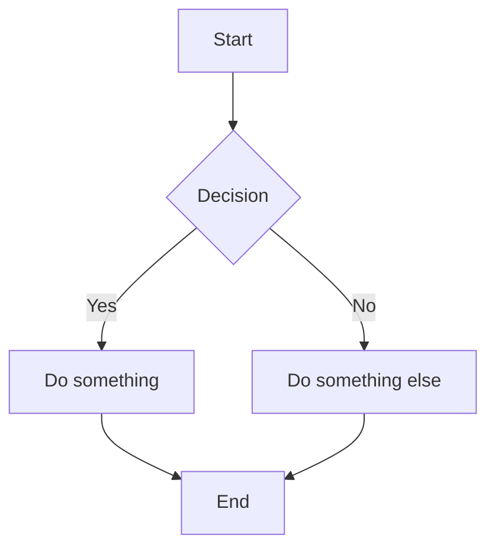

# Linguagens de Programação 1
## Aula Pratica 4 - A base dos programas C

* Repetições
* Funções
* Arrays
* Teste - Fazer uma calculadora

---

## Tipos de dados (primitivas)

| type      | size(32bit) | size(64bit) | example       |
| --------- | :---------: | :---------: | ------------- |
| char      | 1           | 1           | char c = 'a'; |
| short     | 2           | 2           | short s = 175;              |
| int       | 4           | 4           | int i = 2147483647;              |
| long      | 4           | 8           | long int l = 2147483647;              |
| long long | 8           | 8           | long long int ll = 9223372036854775807;              |
| float     | 4           | 4           | float f = 1.0;              |
| double    | 8           | 8           | double d = 1.0;              |
| pointer   | 4           | 8           | int *x = NULL;              |
---

## Usa printf para escrever diferentes tipos de dados
```c {lineNumbers}
char c = ’a’;
short s = 32767;
int i = 2147483647;
long int l = 2147483647;
long long int ll = 9223372036854775806;
float f = 1.0;
double d = 1.0;
int *iptr = NULL;
char* string = "test string";
printf("c: %c\n", c);
printf("s: %i\n", s);
printf("i: %i\n", i);
printf("l: %li\n", l);
printf("ll: %lli\n", ll);
printf("f: %f\n", f);
printf("d: %f\n", d);
printf("iptr: %p\n", iptr);
printf("string: %s\n", string);
```
---

## Control flow: if-else
Examplo:
__Se estiver a chover, leva um guarda-chuva; caso contrário, usa óculos de sol.__

#

```c
int chover = 1;
if (chover) {
    printf("Leva guarda chuva\n");
} else {
    printf("Usa óculos de sol\n"); // executa este bloco se a condição for falsa
}
```
---

## Control flow: if-else

**A minha esposa me diz:** _"Vá ao mercado e traga um litro de leite. Se tiver ovos, traga seis."_

>Eu voltei com o que?

<hr>

<div data-marpit-fragment>

a) 1 litro leite e seis ovos
b) 6 litros leite e seis ovos
c) 6 ovos
d) 6 litros leite
</div>

---

## Control flow: if-else

**A minha esposa me diz:** _"Vá ao mercado e traga um litro de leite. Se tiver ovos, traga seis."_

```c
int main(void) {
    int leite = 0;
    int ovos = 0;

    leite++; // Pego 1l de leite

    printf("Senhor merceeiro, há ovos?");
    scanf(" %d", &ovos);
    if (ovos) leite = 6;

    return 0;
}
```
---
## switch: Escolher entre multiplas opções


A instrução **switch** é como um menu com várias opções, onde o computador escolhe uma com base numa determinada escolha.

```c {lineNumbers}
switch (c) { 
    case 'a' :
    case 'A':
        printf("Opção A\n");
        break; 
    case 'b' :
    case 'B' :
        printf("Opção B\n");
        break;
default:
    printf("Uma opção desconhecida\n");
}
```
---

# Repetições/loops

C também tem três tipos de loops: 
* **for**
* **while**
* **do ... while**

Em vez de escrever 10 **printf** é mais elegante com loops.
## for loop

```c {lineNumbers}
for (int i = 0; i < 10; i++) {
    printf("i=%d\n",i);
}
````
---
## while loop

Enquanto a condição for verdadeira, continua a repetir.

Exemplo:
Enquanto houver bolachas, come mais uma.

```c {lineNumbers}
int numero_bolachas = 10;
while (numero_bolachas != 0) {
    print("Comi bolacha\n",i);
    numero_bolachas--;
}
````
#
> **Nota:** Ao contrário de um loop for, tens de definir a variável da condição antes do loop.
---
## while vs do-while loop

Num do-while verifica a condição ao fim da primeira "volta"



---
## Continue e break

Por vezes, queres parar o processamento do resto do loop e:

* Salta passo e faz próximo: usa **continue**
* Sair do loop/switch antecipadamente: usa **break**

---

# 🔁 Funções: Passagem de Parâmetros
* ✅ Parâmetros podem ser **passados por valor**, ou seja, cópias dos valores originais.

```c
void altera(int x) {
    x = 50;
}
    
int main() {
    int num = 10;
    altera(num);
    printf("Num: %d\n", num); // Saída: 10
    return 0;
}
```

* 🚨 **Atenção:** O valor de _num_ **não é alterado** na função _altera_!
---
## Âmbito das variáveis

O âmbito das variáveis significa que o local onde declaras a tua variável faz diferença no sítio onde podes usá-la.  
O melhor código garante sempre que todas as variáveis têm um âmbito limitado.

- **Variáveis globais**: Variáveis declaradas fora de uma função (e também fora da _main_). Estas variáveis são válidas em todo o ficheiro e só devem ser usadas se não houver uma alternativa melhor.
- **Variáveis locais**: Variáveis declaradas dentro de uma função são válidas apenas dentro dessa função e não podem ser chamadas externamente.

---

## Variáveis Locais
* Definidas **dentro** de uma função, existem apenas no seu scope. A variável existe e é visível **apenas** dentro da **função** depois de ser declarada e só **enquanto** a função estiver a **ser executada**.

```c
void funcao() {
    int local = 20;
    printf("Local: %d\n", local);
}
```

* 🚨 **Fora da função, a variável _local_ é apagada!**

---

# Exercício 1: Repetições

1. Escreve um código em C usando um loop for que faça a contagem decrescente de 10 até 0 e imprima em cada linha "O valor atual é xxx".

2. Faz o mesmo usando um loop while.

3. E novamente, mas agora usando um loop do/while.

> **Nota:** Podes sempre reescrever uma forma na outra. Às vezes, é óbvio, o que leva a um código mais limpo. Na maioria das vezes, é uma questão de gosto.

---
# Exercício 2: Funções

1. Escreve um código em C que implemente uma função _is_divisible_ que retorna um int e recebe como argumentos um valor (int) e um divisor (int). **A função deve verificar se o valor é divisível pelo divisor** (resto igual a 0).

**_int is_divisable(int valor, int divisor);_**

2. Escreve um código em C que implemente uma função _media_ para calcular o valor médio de um array de inteiros. A função recebe 2 argumentos: o tamanho do array (int) e o array (int[]) e retorna um float com o resultado da operação.

**_float media(int len, int arr[]);_**

---
# Exercício 3: funções

1. Escreve um código em C que implemente uma função para realizar uma operação. A função recebe 2 operandos (floats) e um operador (char) como argumentos e retorna um float com o resultado da operação.

O operador pode ser ou '+' ou '-'.

---
# Teste Aula 4 no Moodle do deisi

## https://moodle.deisi.ulusofona.pt


---
