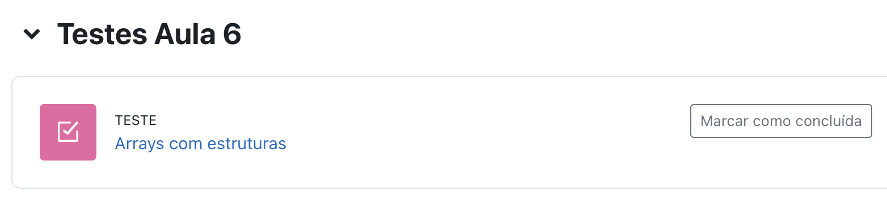

<style>
img[alt="logo"] {
  width: auto;  /* Adjust width */
  height: 25px; /* Keep aspect ratio */
  vertical-align: bottom; /* Align text with the image */
}
img[alt="pic_middle"] {
  width: auto;  /* Adjust width */
  height: 150px; /* Keep aspect ratio */
  vertical-align: middle; /* Align text with the image */
}
.grid {
  display: grid;
  grid-template-columns: 1fr 1fr;
  gap: 20px;
}

img[alt~="center"] {
  display: block;
  margin: 0 auto;
}
ul { list-style-type: none; padding-left: 0;}

</style>


# Conteúdo

- **Revisão**: revisão de teste tecWeb
- **Structures**: juntar variaveis numa novo tipo
- **Array of Structures**: a number of structs

---
# Part 1: 
# Revisão teste tecWeb
---
# Ex. 1: Obter um número par do utilizador

**Dica:** Cria funções auxiliares para modularizar o teu código.

```c
int is_par(const int N) {
    return (!(N % 2)) && (N > 0);
}
```

Verificar se um número é par não é complicado, mas o código fica mais facil de ler se criares uma função.

---
# Ex. 1: Obter um número par do utilizador

```c
int main(void) {
    int value;
    while(1) {
        printf("\nInserir um número: ");
        scanf(" %i", &value);
        if (is_par(value)) {
            printf("O número é par e positivo.\n");
            continue;
        }
        if (value == 0) break;
        printf("O número não é par ou não é positivo.\n");
    }

    printf("Terminado\n");
    return 0;
}
```
---
# Ex. 2: Uma função para verificar se um número é primo

**Dica:** Cria funções auxiliares para modularizar o teu código.

```c
int is_prime(const int N) {
    if (N < 2) {
        return 0;
    }

    for (int i=2; (i*i)<=N; i++) {
        if (N % i == 0) {
            return 0;
        }
    }
    return 1;
}
```

---
# Ex. 2: Uma função para verificar se um número é primo

```c
int main(void) {

    int value;
    do {
        printf("\nInserir um número: ");
        scanf(" %i", &value);
        printf("O número %s é primo.\n", is_prime(value)?"":"não ");
    } while(value != 0);

    printf("Terminado\n");
    return 0;
}
```
---
# Ex. 3: Conjectura de GoldBach

Ela diz que todo número par maior que 2 pode ser representado pela soma de dois números primos.

**Dica:** Cria funções auxiliares para modularizar o teu código.

```c
void goldbach(int value) {
    int first = 1;
    printf("%d é a soma de: ", value);
    for (int i=2; i<=(value / 2); i++) {
        if (is_prime(i) && is_prime(value-i)) {
            printf("%s(%i, %i)", first?"":", ", i, value-i);
            first = 0;
        }
    }
    printf(".\n");
}
```
---
# Ex. 3: Conjectura de GoldBach

```c
int main(void) {
    int value;
    while(1) {
        printf("\nInserir um número: ");
        scanf("%i", &value);
        if (is_par(value)) {
            goldbach(value);
            continue;
        }
        if (value == 0) break;
        printf("O número não é par ou não é positivo.\n");
    }

    printf("Terminado\n");
    return 0;
}
```

---
# Ex. 4: Fatorização em primos

Um método simples para decompor um número em fatores primos é
- escrevê-lo à esquerda de uma linha vertical. 
- À direita escreve-se seu menor divisor primo. 
Após realizar a divisão, o resto fica abaixo do número original e o processo continua até o resto ser 1.

**Dica:** Cria funções auxiliares para modularizar o teu código.

```c
int factorisation(int store_dec[2][MAX_PRIME_DIV], int value) {
    int red_value = value;
    int index = 0;
    for (int i=2; red_value > 1; i++) {
        if (!is_prime(i) || (red_value % i)) continue;

        store_dec[0][index] = i;
        while (!(red_value % i)) {
            red_value = red_value / i;
            store_dec[1][index]++;
        }
        index++;
    }
    return index;
}
```
---
# Ex. 4: Fatorização em primos

**Dica:** Cria funções auxiliares para modularizar o teu código.

```c
void show_factors(int store_dec[2][MAX_PRIME_DIV], int max_idx) {
    for (int i=0; i<max_idx; i++) {
        printf("%i  ", store_dec[0][i]);
        if (store_dec[0][i] <10) printf((" "));
    }
    printf("\n");
    for (int i=0; i<max_idx; i++) {
        printf("%i  ", store_dec[1][i]);
        if (store_dec[1][i] <10) printf((" "));
    }
    printf("\n");
}
```
---
# Ex. 4: Fatorização em primos

**Dica:** Cria funções auxiliares para modularizar o teu código.

```c
void show_formula(int store_dec[2][MAX_PRIME_DIV], int max_idx, int value) {
    if (store_dec[1][0] == 1) {
        printf("\n%i = %i", value, store_dec[0][0]);
    } else {
        printf("\n%i = %i^%i", value, store_dec[0][0], store_dec[1][0]);
    }

    for (int i=1; i<max_idx; i++) {
        if (store_dec[1][i] == 1) {
            printf(" * %i", store_dec[0][i]);
        } else {
            printf(" * %i^%i", store_dec[0][i], store_dec[1][i]);
        }
    }
    printf("\n");
}
```
---
# Ex. 4: Fatorização em primos

```c
int main(void) {
    int value;
    do {
        printf("\nPlease enter a positive number: ");
        scanf(" %i", &value);
        if (value <= 1) continue;

        int store_dec[2][MAX_PRIME_DIV] = {0};
        int index = factorisation(store_dec, value);
        show_factors(store_dec, index);
        show_formula(store_dec, index, value);

    } while (value != 0);

    printf("Terminado\n");
    return 0;
}
```
---
# Part 2: 
# Structures
---
# Estruturas (`struct`) em C

As `structs` em C permitem agrupar diferentes tipos de dados numa única estrutura lógica.


```c
#include <stdio.h>

struct Pessoa {
    char nome[50];
    int idade;
    float altura;
};
```

Aqui criamos uma `struct` chamada `Pessoa` que contém três membros: uma string, um inteiro e um `float`.

---

# Utilização de `structs`

```c
struct Pessoa pessoa1;
pessoa1.idade = 25;
pessoa1.altura = 1.75;
strcpy(pessoa1.nome, "João");
```

Podemos declarar variáveis do tipo `struct Pessoa` e atribuir valores aos seus membros.

---

# Uso com `typedef`

```c
typedef struct Pessoa{
    char nome[50];
    int idade;
} pessoa_st;

pessoa_st pessoa2;
```

O `typedef` simplifica a sintaxe, permitindo criar `structs` sem necessidade de `struct` antes do nome.

---

## Array de `structs`

```c
pessoa_st pessoas[3] = {
    {"Ana", 30},
    {"Bruno", 25},
    {"Carla", 28}
};
```

Podemos criar um array de `structs` para armazenar múltiplas pessoas.

---
# Ex. Criar um struct para Nobel laureates

Cria um struct para um Nobel laureates que tem os seguintes membros:

> name (max. 100 characters)
> ano de nascimento
> area de trabalho
> nobel award
> ano do award

---
# Ex. Criar um struct para Nobel laureates

```c
#define MAX_LENGTH 100

typedef struct nobel_st{
    char name[MAX_LENGTH];
    int birth_year;
    char area[MAX_LENGTH];
    char award[MAX_LENGTH];
    int award_year;
} nobel_t;

```
---
# Ex. Criar um struct para Nobel laureates

```c
int main(void) {

  nobel_t laureate = {"António Egas Moniz", 1874, "Medicine", "Therapeutic Value of Lobotomy", 1949};

  printf("%s (%d) - %s: %s [%d]\n",
               laureate.name, 
               laureate.birth_year, 
               laureate.area,
               laureates.award, 
               laureate.award_year);

  return 0;
}
```
---
# Ex. Criar um array de struct para Nobel laureates
```c
#define NUM_LAUREATES 15

  // Array of Nobel Laureates
  nobel_t laureates[NUM_LAUREATES] = {
          {"Albert Einstein", 1879, "Physics", "Theory of Relativity", 1921},
          {"Marie Curie", 1867, "Physics", "Radioactivity", 1903},
          {"Marie Curie", 1867, "Chemistry", "Discovery of Radium and Polonium", 1911},
          {"Alexander Fleming", 1881, "Medicine", "Discovery of Penicillin", 1945},
          {"Ernest Hemingway", 1899, "Literature", "For his mastery of narrative art", 1954},
          {"Mother Teresa", 1910, "Peace", "Humanitarian Work", 1979},
          {"Martin Luther King Jr.", 1929, "Peace", "Civil Rights Movement", 1964},
          {"Richard Feynman", 1918, "Physics", "Quantum Electrodynamics", 1965},
          {"Linus Pauling", 1901, "Chemistry", "Chemical Bonding", 1954},
          {"Linus Pauling", 1901, "Peace", "Anti-Nuclear Activism", 1962},
          {"Malala Yousafzai", 1997, "Peace", "Education Rights Advocacy", 2014},
          {"Jean-Paul Sartre", 1905, "Literature", "Existentialist Philosophy", 1964},
          {"Barack Obama", 1961, "Peace", "Diplomatic International Relations", 2009},
          {"Bob Dylan", 1941, "Literature", "Poetic Expressions in Music", 2016},
          {"Emmanuelle Charpentier", 1968, "Chemistry", "CRISPR Gene Editing", 2020}
```
---
# Ex. Criar um array de struct para Nobel laureates
```c
    // Print the laureates
    for (int i = 0; i < NUM_LAUREATES; i++) {
        printf("%s (%d) - %s: %s [%d]\n",
               laureates[i].name, laureates[i].birth_year, laureates[i].area,
               laureates[i].award, laureates[i].award_year);
    }
```
---
# Ex. Procura no array

**Moodle do DEISI: https://moodle.deisi.ulusofona.pt/course/view.php?id=20**
Cria uma função que encontre um laureate pelo nome e imprime os dados.



---
# Teste Mini Projeto

Em semelhança com o teste TecWeb um mini-projeto para fazer até a proximo dia 7/4/2025@23:59 no moodle do DEISI.

Podem encontrar aqui: https://github.com/p8094/LP1labs/tree/main/MiniProjeto


---
# ❓ Q&A  

💬 **Dúvidas?**  

