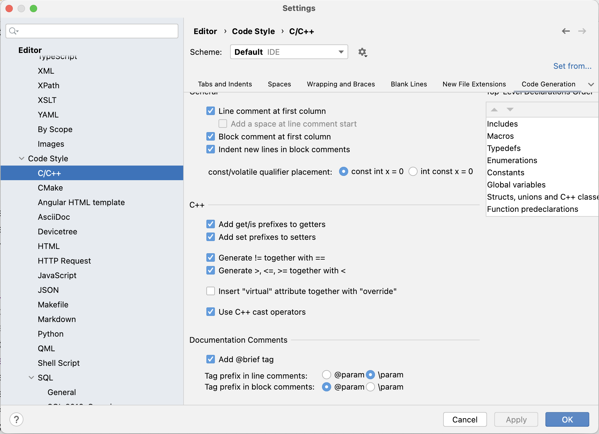

<style>
img[alt="logo"] {
  width: auto;  /* Adjust width */
  height: 25px; /* Keep aspect ratio */
  vertical-align: bottom; /* Align text with the image */
}
img[alt="pic_middle"] {
  width: auto;  /* Adjust width */
  height: 150px; /* Keep aspect ratio */
  vertical-align: middle; /* Align text with the image */
}
.grid {
  display: grid;
  grid-template-columns: 1fr 1fr;
  gap: 20px;
}

img[alt~="center"] {
  display: block;
  margin: 0 auto;
}
</style>


# Conteúdo

- **Ponteiros**: The good, the bad and the ugly
- **Mini Projetos**: Apoio 
- **Teste**: Coderunner e Pandora (preparação para projeto final) 

---

## O que são apontadores?

* São variáveis que guardam **endereços de memória**.

<div class='grid'><div>


```c
int x = 14;
int *x_ptr = &x;
```

* 🖥️ `x_ptr` **guarda o endereço** de `x`, não o seu valor. Por isso diz-se que `x_ptr` aponta para `x`.

</div><div>


<small>

| Endereço | Conteúdo | Identificador |
|------|------|-----------|
| 1024 |  `14` | `x` | 
| ... |   |  | 
| 2036 |  `1024` | `x_ptr` | 

</small>

</div></div>

* 📌 **Qualquer que seja o tipo do apontador, ocupa sempre 8 bytes**


---

## 🔗 Apontadores para que servem?

* 📢 **A partir do apontador, podemos aceder ao valor da variável original**

* 📌 Para isso usa-se o operador **desreferência:** `*` 
<div class='grid'><div>


```c
int x = 14;
int *x_ptr = &x;
```

</div><div>


<small>

| Endereço | Conteúdo | Identificador |
|------|------|-----------|
| 1024 |  `14` | `x` | 
| ... |   |  | 
| 2036 |  `1024` | `x_ptr` | 

</small>

</div></div>


```c
// ler o conteúdo que está no enderço dado por x_ptr
printf("Valor de x = %d\n", *x_ptr);

// alterar o conteúdo que está no enderço dado por x_ptr
*x_ptr = 84;
```

---

# 📌 Operador `&` (referência)

* 📍 Obtemos o **endereço de uma variável** com `&`:

<div class='grid'><div>


```c
int x = 14;
int *x_ptr = &x;

printf("Endereço de x: %p\n", (void*)x_ptr);
```

</div><div>


<small>

| Endereço | Conteúdo | Identificador |
|------|------|-----------|
| 1024 |  `14` | `x` | 
| 2028 |  `1024` | `x_ptr` | 

</small>

</div></div>


🔍 `&x` **retorna o endereço** da variável `x`!

---

# 📌 Operador `*` (des-referência)

Permite aceder ao **valor armazenado no endereço** apontado:

<div class='grid'><div>


```c
int x = 14;
int *ptr = &x;

int k = *ptr;  // k recebe o valor de x
```

</div><div>


<small>

| Endereço | Conteúdo | Identificador |
|------|------|-----------|
| 1024 |  `14` | `x` | 
| 2028 |  `1024` | `ptr` |
| 2036 | `14`| `k` |

</small>

</div></div>


🔗 `*ptr` **acede ao valor guardado no endereço armazenado em `ptr`**.

---

# ⚡ Passagem de Argumentos por Referência


<div class='grid'><div>

```c
void troca(int *x, int *y) {
    int aux = *x;
    *x = *y;
    *y = aux;
}

int main(void) {
    int x = 14, y = 28;
    troca(&x, &y);
    printf("x = %d, y = %d\n", x, y);
    return 0;
}
```

</div><div>


<small>

| End. | Conteúdo | Id | |
|------|------|-----------|-|
| 100 |  `500` | `x` | `stack frame troca()` |
| 108 |  `504` | `y` | `stack frame troca()` |
| 104 |  `14` | `aux` | `stack frame troca()` |
| ... |  `<lixo>` |   | `<vazio>            ` |
| 500 |  `14` | `x` | `stack frame main()` |
| 504 |  `28` | `y` | `stack frame main()` |

</small>

</div></div>


* 📢 **Agora `x` e `y` são alterados corretamente!** 🚀

---

# 🔄 Passagem por Valor vs Referência

| Passagem por Valor | Passagem por Referência |
|--------------------|------------------------|
| Copia os valores | Passa os endereços |
| Não altera as variáveis originais | Pode alterar as variáveis originais |


```c
troca(x, y);    // Passagem por valor
troca(&x, &y);  // Passagem por referência
```

* 📌 Há situações em que é mais eficiente fazer passagem por referência, mas nem sempre.


---

# 🧠 Aritmética de Apontadores

<div class='grid'><div>


```c
int a = 5;
int b = 10;

int *aptr = &a;
```

- **Qual o valor de `aptr` se fizermos:**

<div data-marpit-fragment>

```c
aptr++;
```

</div>

</div><div>


<small>

| Endereço | Conteudo | Identificador |
|------|------|-------|
| 256  |  5   | a     |
| 260  |  10  | b     |
| 264  |  256 | aptr  |

</small>


</div></div>


<div class='grid'><div>

* Uma vez que `aptr` é do tipo apontador para inteiro...
* O operador `++` avança 4 bytes → aponta para o próximo inteiro

</div><div>


<div data-marpit-fragment>

<small>

| Endereço | Conteudo | Identificador |
|------|------|-------|
| 256  |  5   | a     |
| 260  |  10  | b     |
| 264  |  260 | aptr  |

</small>

</div>

</div></div>


---

## ❓ Qual o novo valor de `aptr`?

* Intuitivamente: 256 + 1 = 257 ❌
* Mas 257 é um byte do meio de uma variável 🤯
* Com `aptr++`, o ponteiro vai para `260`

* 🧠 Porque `int` ocupa 4 bytes!

---

## 🔢 Aritmética e Tipo de Dados

* O número de bytes depende do tipo:
  * `char` 👉 1 byte
  * `int` 👉 4 bytes
  * `float` 👉 4 bytes
  * `double` 👉 8 bytes

---

# ➕ Incremento, ➖ Decremento

```c
int *ptr = &x[0];
ptr += 10; // aponta para x[10]

ptr = &x[10];
ptr -= 10; // volta a x[0]
```

* `ptr += 10` 👉 avança `10 * sizeof(int)` bytes
* `ptr -= 10` 👉 recua `10 * sizeof(int)` bytes

* porque `ptr` é um ponteiro para inteiro. Se fosse um ponteiro para `char` avançaria/recuaria `10 * sizeof(char)`
---

# ➖ Diferença entre Apontadores

<div class='grid'><div>


```c
int strlen(char s[]) {
  char *ptr = &s[0];

  while (*ptr != '\0')
    ptr++;
  
  return (int)(ptr - &s[0]);
}
```

* Permite saber quantos elementos existem entre dois endereços 🧮
* Apenas válido entre apontadores do mesmo tipo ✅

</div><div>


* **🔍 Exemplo: `strlen`**

* `ptr = &s[0]`
* `ptr` vai andando até `\0`
* A diferença é o comprimento da string 🧵

Se `ptr` chegou a 259 e `&s[0]` era 256:

👉 `259 - 256 = 3`

</div></div>

---

# 🔁 Comparar Apontadores

* Pode-se comparar apontadores do mesmo tipo:
  * `==`, `!=`, `>`, `<`, `>=`, `<=`

```c
while (ptr >= ptr2)

if (ptr1 != ptr2)

if (ptr1 != NULL)
```

---

# Operações com apontadores

<small>

| Operação | Exemplo | Observações |
|----------|---------|-------------|
| Atribuição | `ptr = &x` | podemos atribuir um valor (endereço) a um apontador. Se quisermos que aponte para nada podemos atribuir-lhe o valor da constante `NULL`|
| Incremento | `ptr = ptr + 2` | Incremento de `2*sizeof(tipo)`|
|Decremento| `ptr = ptr - 10` | Decremento de `10*sizeof(tipo)` |
|Apontado por| `*ptr` | O operador desreferência permite obter o valor existente na posição cujo endereço está armazenado em ptr|

</small>

---
# Operações com apontadores

<small>

| Operação | Exemplo | Observações |
|----------|---------|-------------|
| Endereço de | `&ptr` | Tal como qualquer outra variável, um apontador ocupa espaço em memória. Desta forma podemos saber qual o seu endereço.|
| Diferença | `ptr1-ptr2` | Permite-nos saber qual o número de elementos entre `ptr1` e `ptr2` |
|Comparação |`ptr1 > ptr2` | Premite-nos verificar, por exemplo, qual a ordem de dois elementos num vector através dos seus endereços.|

</small>

---
# 🎯 Formatação em C — Porquê é Importante?

- ✅ Torna o código **mais legível e compreensível**
- 🔧 Facilita a **manutenção** e o trabalho em grupo
- 🧠 Ajuda a evitar erros (ex: blocos mal alinhados)
- 📚 Torna o código mais fácil de **ensinar/aprender**
- 🤖 Ferramentas como `clang-format` podem ajudar

---

# 📐 Regras Básicas de Formatação

- 🧱 **Indentação consistente** (espaços ou tabulações — escolha um!)
  ```c
  if (x > 0) {
      printf("Positivo\n");
  }
  ```

* linhas curtas (< 80 ou 100 colunas)

* 🎯 Use espaços entre operadores:

  ```c
  x = a + b;
  ```
---
# Outras Boas Práticas
* 📌 Separe blocos de código com linhas em branco

* 🔠 Nomeie variáveis com sentido: media, contador, total

* 🔧 Agrupe variáveis por tipo e propósito

* 💬 Comente blocos complexos, não cada linha

* ✅ Use nomes de funções com verbos: calculaSoma(), imprimeMenu()

* 📁 Organização em ficheiros .h (declarações) e .c (implementações)

---

# Comentando Código em C  
### Como, Quando e Por Quê

*  Comentários ajudam na **manutenção**, **documentação** e **compreensão** do código.

*  Boas práticas de comentário facilitam o trabalho em equipe e o uso de ferramentas como o CLion.

---
# Quando Comentar Código

✅ Use comentários quando:

* O propósito do código **não for óbvio**.
* A lógica for **complexa ou não trivial**.
* Para **explicar decisões** de design.

🚫 Evite comentários redundantes:
```c
// Incrementa i
i++; // Desnecessário se for óbvio
```
---

# Tipos de Comentários
## Comentário em linha:

```c
x = x + 1; // Incrementa x
```

## Comentário em bloco:
```c
/*
 * Esse bloco faz a inicialização
 * do sistema e configura o timer
 */
```
---

# Comentário de Função (Estilo JavaDoc)

Use /** */ acima das funções para gerar documentação automática (no CLion):

```c
/**
 * Soma dois inteiros.
 *
 * @param a Primeiro inteiro
 * @param b Segundo inteiro
 * @return Resultado da soma
 */
int soma(int a, int b) {
    return a + b;
}
```

--- 


# CLion (dica)



---

# O que é o estilo JavaDoc?

* Originalmente criado para **Java**.
* Usa comentários `/** ... */` acima de funções, structs, etc.
* Ferramentas como **CLion** e **Doxygen** reconhecem esse estilo.
* Gera documentação automática em HTML, LaTeX, etc.

---

## Por que usar JavaDoc em C?

✅ Benefícios:

* Documentação clara para funções e estruturas.
* Compatibilidade com IDEs como CLion.
* Geração automática de manuais e referências do código.
* Facilita onboarding de novos programadores.

---

## Exemplo de Documentação com JavaDoc

```c
/**
 * @brief Calcula a potência de um número.
 *
 * @param base A base da potência.
 * @param expoente O expoente.
 * @return O valor de base elevado ao expoente.
 */
int potencia(int base, int expoente) {
    int resultado = 1;
    for (int i = 0; i < expoente; i++) {
        resultado *= base;
    }
    return resultado;
}
```
---

# Marcadores Comuns (Tags)

* `@param`: Descreve um parâmetro da função.
* `@return`: Descreve o valor de retorno da função.
* `@author`: Nome do autor do código.
* `@version`: Versão do código.
* `@see`: Referência a outra parte do código.
* `@note`, `@warning`:  Para notas e avisos

---

# Example: Doxygen em C

[doxygen_c.h](https://fnch.users.sourceforge.net/doxygen_c.html)


[doxygen_c_preview](https://fnch.users.sourceforge.net/doxygen_c/html/doxygen__c_8h.html)

--- 


# Boas Práticas

* Comente o "porquê", não apenas o "o quê".

* Atualize os comentários ao alterar o código.

* Mantenha o comentário claro, conciso e relevante.

* A lingua das comentarios e deviam estar em linha com os do codigo (se o codigo tem variaveis/funções em Ingles, os comentarios tambem devem ser em ingles).

---


# Obrigatoriadade

Podemos concordar num *minimo* de comentarios com o estilo JavaDoc para:
- Todos os ficheiros:
  - `@brief, @author, @version`
  - `@author`: `<nome>` [student-id]

- Todos os funções:
  - `@brief`: Breve descrição da função
  - `@param`: Descrição de cada parâmetro
  - `@return`: Descrição do valor de retorno

---

# Obrigatoriadade 
E colocamos comentarios "normais":
* O propósito do código **não for óbvio**.
* A lógica for **complexa ou não trivial**.
* Para **explicar decisões** de design.

---
# Resumo

* Use /** */ para documentar funções no estilo JavaDoc.

* Comente para esclarecer, não para repetir o código.

* Bons comentários ajudam hoje e no futuro do projeto.

<br />
<br />
<br />

💡 Talvez é o parte mais dificil do codigo. Muitas vezes, depois de escrever os comentarios percebemos o algoritmo melhor e o codigo pode ser melhorado.

---


# ❓ Q&A  

💬 **Dúvidas?**  

