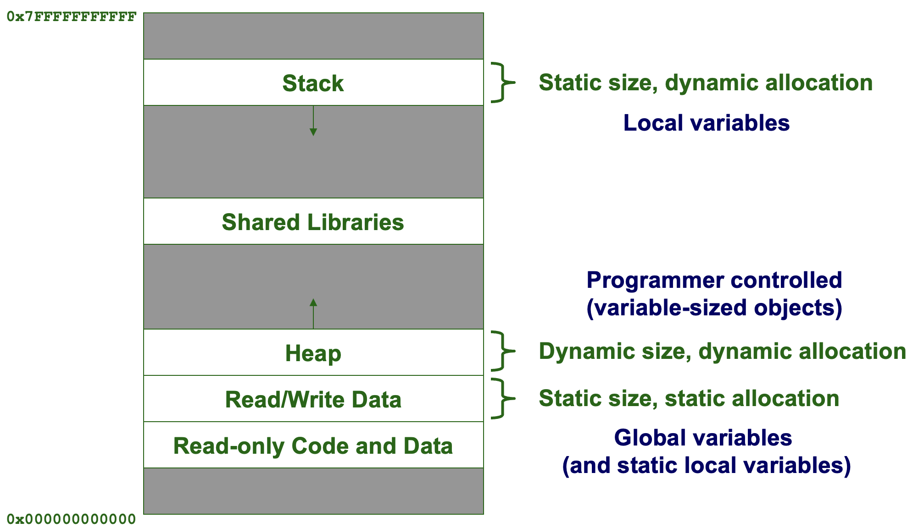

<style>
img[alt="logo"] {
  width: auto;  /* Adjust width */
  height: 25px; /* Keep aspect ratio */
  vertical-align: bottom; /* Align text with the image */
}
img[alt="pic_middle"] {
  width: auto;  /* Adjust width */
  height: 150px; /* Keep aspect ratio */
  vertical-align: middle; /* Align text with the image */
}
.grid {
  display: grid;
  grid-template-columns: 1fr 1fr;
  gap: 20px;
}

img[alt~="center"] {
  display: block;
  margin: 0 auto;
}
</style>

# Conteúdo

- **Memoria Dynamica**
- **Command Line Arguments**
- **Listas Ligadas**

---
# Memoria Dynamica

```c
#include <stdlib.h>

int *array = malloc(num_items * sizeof(int));
```
Alocar memória dinamicamente:
- Passe um tamanho (número de bytes a alocar)
  - Encontra memória não utilizada que seja suficientemente grande para conter o número de bytes especificado e a reserva
- Retorna um void * que aponta para a memória alocada
  - Não é necessário typecast para atribuição de ponteiro
- Essencialmente equivalente a new em Java (e C++)

---
# malloc()

```c
int *array = malloc(num_items * sizeof(int));

if (array == NULL) {
    fprintf(stderr,"Erro: não foi possível alocar memória\n");
}
```

<br />
<br />

<i class="fas fa-triangle-exclamation"></i> Os slides não tem esta verificação, mas os programas devem ter esta verificação

---

# Allocação da memoria



---

# Porque esta diferença da memoria stack e heap?

A alocação de heap é a mais geral
- Suporta qualquer tamanho e número de alocações

Porque não o usamos para tudo?
- Desempenho

A alocação **estática** não demora tempo de execução

A alocação no **stack** demora ordens de grandeza menos tempo de execução do que a alocação de **heap**

---

# Altervativos ao malloc()

** calloc()**: como malloc(), mas inicializa a memória com zeros
```c
int *array = calloc(num_items, sizeof(int));
```
<br />

**realloc()**: redimensiona um bloco de memória previamente alocado
```c
array = realloc(array, new_size * sizeof(int));
```
<br />

**strdup()**: aloca memória para uma cópia de uma string
```c
#include <string.h>
char *str = strdup("Hello, World!");
```

---

# free()

Todo o memoria allocada com malloc() deve ser libertada com free()

```c
free(array);
``` 

<br />

Opcional:

```c
free(array);
array = NULL; // Assim garantimos que não tentamos usar o array
``` 

---

# Argumentos da Linha de Comando em C

Em C, programas podem receber parâmetros pela linha de comando usando a função _main_

```c
int main(int argc, char *argv[]) {
    // argc: número de argumentos
    // argv: array de strings com os argumentos
}
```

- **argc:** número de argumentos passados (inclui o nome do programa).

- **argv:** vetor de strings (array de char *) com os argumentos.

---
# Exemplo de execução:

```bash
./programa arquivo.txt
```

- **argc**: é 2

- **argv[0]** é "./programa"

- **argv[1]** é "arquivo.txt"

---

# Listas Ligadas em C

**Lista ligada:** conjunto de estruturas de dados (nós) que contêm referências a outras estruturas de dados


---

# Linked Lists vs. Arrays

- As listas ligadas podem crescer e diminuir conforme necessário, ao contrário dos vetores, que têm um tamanho fixo _(podes fazer realloc para aumentar um array)_

- As listas ligadas podem inserir um nó entre outros nós facilmente


---

# Organização dos nós

Um nó contém:
- dados: um ou mais campos de dados – podem ser organizados como estrutura, objeto, etc.
- um ponteiro que pode apontar para outro nó


---

# Organização duma lista ligada

- A lista ligada contém 0 ou mais nós:


- Tem um cabeçalho de lista a apontar para o primeiro nó
- O último nó aponta para NULL

---

# Lista Vázia

- Se uma lista contém atualmente 0 nós, é uma lista vazia
- Neste caso, o cabeçalho da lista aponta para NULL


---

# Declaração dum nó

```c
struct node_st {
    int data;
    struct node_st *next;
};
```

Ou, usando typedef (preferido):

```c
typedef struct node_st {
    int data;
    struct node_st *next;
} node_t;
```

<i class="fas fa-triangle-exclamation"></i> Note: No memory is allocated at this time

---

# Definir uma lista ligada

- Defina um ponteiro para o início da lista:

```
node_t *head = NULL;
```

- Ponteiro de cabeça inicializado como NULL para indicar uma lista vazia


---

# NULL Pointer

- É utilizado para indicar o fim da lista
- Deve ser sempre testado antes de utilizar um ponteiro:

```c
if (head != NULL) {
    // faça algo com o primeiro nó
}
```

- ou

```c
node_t *p = head;
while (p) {
    // Faça algo com o nó atual
    p = p->next;
}
```
---

# Operações com listas ligadas

- Inserir um nó no início da lista
- Inserir um nó no fim da lista
- Inserir um nó entre dois nós
- Remover um nó
- Procurar um nó
- Destruir uma lista

---

# Cria um novo nó

node_t *new_node = malloc(sizeof(node_t));


new_node->data = 23;


new_node->next = NULL;


---

# Inserir um nó no início da lista

```c
node_t *new_node = malloc(sizeof(node_t));
new_node->data = 10;
new_node->next = head;
head = new_node;
```

---

## Cria uma função para inserir um nó no início da lista

```c
/** 
 * @brief Insere um nó no início da lista
 * 
 * @param head Ponteiro para o início da lista
 * @param data Dado a inserir
 * @return 1 se sucesso, 0 se erro
*/
int insert_at_beginning(node_t **head, int data);
```

---

# Cria uma função para inserir um nó no início da lista

```c
/** 
 * @brief Insere um nó no início da lista
 * 
 * @param head Ponteiro para o início da lista
 * @param data Dado a inserir
 * @return 1 se sucesso, 0 se erro
*/
int insert_at_beginning(node_t **head, int data) {
    node_t *new_node = malloc(sizeof(node_t));
    if (new_node == NULL) return 0;
    
    new_node->data = data;
    new_node->next = *head;
    *head = new_node;
    return 1;
}
```

Repara no parametro: `node_t **head`

---

# Inserir um nó no fim da lista

```c
node_t *new_node = malloc(sizeof(node_t));
new_node->data = 20;
new_node->next = NULL;

if (head == NULL) {
    head = new_node;
} else {
    node_t *p = head;
    while (p->next != NULL) {
        p = p->next;
    }
    p->next = new_node;
}
```

---

# Cria uma função para inserir um nó no fim da lista

```c
/** 
 * @brief Insere um nó no fim da lista
 * 
 * @param head Ponteiro para o início da lista
 * @param data Dado a inserir
 * @return 1 se sucesso, 0 se erro
*/
int insert_at_end(node_t **head, int data);
```
---
# Cria uma função para inserir um nó no fim da lista

```c
int insert_at_end(node_t **head, int data) {
    node_t *new_node = malloc(sizeof(node_t));
    new_node->data = data;
    new_node->next = NULL;
    if (new_node == NULL) return 0;

    if (*head == NULL) {
        *head = new_node;
    } else {
        node_t *p = *head;
        while (p->next != NULL) {
            p = p->next;
        }
        p->next = new_node;
    }
    return 1;
}
```

---

# Inserir um nó entre dois nós

```c
node_t *node_ptr = malloc(sizeof(node_t));
node_ptr->data = 15;
node_ptr->next = previous_node->next;
previous_node->next = node_ptr;
```


---

# Remover um nó

```c
node_t *node_ptr; // nó a remover
previous_node->next = node_ptr->next;
free(node_ptr);
```
*A nó para remover pode ter mais ponteiros*


---
# Procurar um nó

```c
node_t *p = head;
while (p != NULL) {
    if (p->data == value) {
        // encontrado
    }
    p = p->next;
}
```
---

# Cria uma função para procurar um nó 

```c
/** 
 * @brief Procura um nó com um valor especifico
 * 
 * @param head Ponteiro para o início da lista
 * @param value Valor a procurar
 * @return node_t* Ponteiro para o nó encontrado, NULL se não encontrado
*/
node_t *search_node(node_t *head, int value);
```
---

# Cria uma função para procurar um nó

```c
/** 
 * @brief Procura um nó com um valor especifico
 * 
 * @param head Ponteiro para o início da lista
 * @param data Valor a procurar
 * @return Ponteiro para o nó encontrado, ou NULL se não encontrado
*/
node_t *find_node(node_t *head, int data) {
    node_t *p = head;
    while (p != NULL) {
        if (p->data == data) {
            return p;
        }
        p = p->next;
    }
    return NULL;
}
```

---

# Destruir uma lista

```c
node_t *p = head;
while (p != NULL) {
    node_t *temp = p;
    p = p->next;
    free(temp);
}
head = NULL;
```

---
# Variações das listas ligadas

**doubly-linked list:** each node contains two pointers: one to the next node in the list, one to the previous node in the list


```c
typedef struct node_st {
    int data;
    struct node_st *next;
    struct node_st *prev;
} node_t;
```

---

# ❓ Q&A  

💬 **Dúvidas?**  

