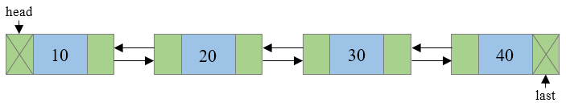
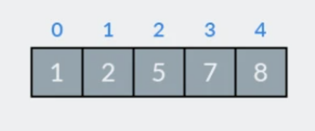

# Conteúdo

- **Ficheiros**
  Nesta aula vamos ler ficheiros CSV (Comma Separated Values). 

- **Doubly Linked List**
  Vamos criar uma lista duplamente ligada e inserir dados no fim.

- **BubbleSort**
  Aprendemos ordenar uma list com "BubbleSort"

- **InsertSort**
  Em vez de usar "BubbleSort", podemos ler o ficheiro e inserir os dados logo ordenados.
  

---
# Manipulação de ficheiros em C

O tratamento de ficheiros em C é o processo no qual criamos, abrimos, lemos, escrevemos e fechamos operações num ficheiro. 

A linguagem C disponibiliza diferentes funções, como por exemplo `fopen()` , `fwrite()` , `fread()` , `fseek()` , `fprintf()` , etc. para executar a entrada, saída e muitas operações diferentes do ficheiro C no nosso programa.

Em C usamos um ponteiro para o macro `FILE`para referir a ficheiros abertos.

```c
FILE *pointer_name;
```

---
# Operações com ficheiros

* Abertura do ficheiro
* Leitura / escrita
* Fecho do ficheiro

```c
#include <stdio.h>

FILE *fp;
fp = fopen("dados.txt", "r");
if (fp == NULL) {
    fprintf(stderr, "Erro ao abrir o ficheiro\n");
}
```

---

# Modos de abertura (texto)

| Modo | Significado | Comportamento |
|------|-------------|----------------|
| "r"   | Read        | Abre para leitura. Erro se não existir. |
| "w"   | Write       | Cria novo ficheiro ou apaga existente. |
| "a"   | Append      | Abre para escrever no fim. Cria se não existir. |
| "r+"  | Read+Write  | Abre para leitura e escrita. Erro se não existir. |
| "w+"  | Write+Read  | Cria novo para leitura e escrita. Apaga se existir. |
| "a+"  | Append+Read | Lê e escreve no fim. Cria se não existir. |

Acrescentar `b` → modo binário: "rb", "wb+", etc.

---

# Escrever ficheiros de texto

```c
FILE *fp = fopen("exemplo.txt", "w");
if (fp != NULL) {
    fprintf(fp, "Olá mundo!\n");
    fclose(fp);
}
```

* `fprintf`, `fputs`, `fputc`

---

# er ficheiros de texto

```c
FILE *fp = fopen("exemplo.txt", "r");
char linha[100];

if (fp != NULL) {
    while (fgets(linha, 100, fp)) {
        printf("%s", linha);
    }
    fclose(fp);
}
```

* `fscanf`, `fgets`, `fgetc`

---

# Fechar ficheiros

```c
fclose(fp);
```

* Garante que os dados são escritos fisicamente em disco
* Liberta o ficheiro para outros programas

---
# Outras funções úteis

```c
int feof(FILE *fp);     // fim do ficheiro
int ferror(FILE *fp);   // erro no ficheiro
int fflush(FILE *fp);   // forçar escrita do buffer
void rewind(FILE *fp);  // cursor para o início
long ftell(FILE *fp);   // posição atual
int fseek(FILE *fp, long offset, int origem); // reposicionar
```

---
# Obter o tamanho do ficheiro

```c
/**
 * @brief Obtém o tamanho de um ficheiro em bytes.
 *
 * @param nome_ficheiro Nome (ou caminho) do ficheiro a ser analisado.
 * @return O tamanho do ficheiro em bytes, ou -1 se ocorrer um erro.
 */
long get_file_size(const char *nome_ficheiro) {
    FILE *ficheiro = fopen(nome_ficheiro, "r");
    if (ficheiro == NULL) return -1;

    fseek(ficheiro, 0, SEEK_END);    // Ir para o fim do ficheiro
    long tamanho = ftell(ficheiro);  // Obter a posição atual (tamanho)
    fclose(ficheiro);

    return tamanho;
}
```
---
# Excercisio 9.1 - Tamanho do ficheiro

Obter o tamanho do ficheir que é passada com argumento do programa
<hr />

### Dica para Clion
Copia o ficheiro countries-list.csv para a pasta do projeto. Depois no menu seleciona: `Run`-> `Edit Configurations`e adiciona o ficheiro no `Program Arguments`


---
# Excercisio 9.2 - Contar linhas (skip linhas com '#')

```c
#define MAX_LINE 1024

int main(int argc, char *argv[]) {
    char linha[MAX_LINE];
    FILE *fp = fopen(argv[1], "r");
    if (fp == NULL) {
        printf("Erro abrir o ficheiro \"%s\"\n", argv[1]);
        return 0;
    }
    int linhas = 0;
    while (fgets(linha, MAX_LINE-1, fp)) {
        // codigo aqui

    }
    fclose(fp);
    printf("Este ficheir tem %d linhas\n", linhas);
}
```
---
# Doubly Linked List

**doubly-linked list:** each node contains two pointers: one to the next node in the list, one to the previous node in the list


```c
typedef struct node_st node_t;

struct node_st {
    int data;
    node_t *next;
    node_t *prev;
};
```
---
# Doubly Linked List

* O primeiro e o último nó de uma lista ligada contêm um terminador (NULL). 
* Permite a travessia de nós em ambas as direções. * A estrutura básica de uma lista duplamente ligada é representada como:



---

# Inserir no fim

Assume que temos os ponteiros `head` e `tail`

1. Allocar memory para o `new_node`
2. Initialisar o `new_node`
3. Aponta o `new_node`->`prev`para o ultimo elemento
4. Aponta o `ultimo elemento`->`next`para `new_node``

```c
if (head == NULL) {    // Lista era vazia
    head = new_elem;
    tail = new_elem;
} else {
    tail->next = new_elem;
    new_elem->prev = tail;
    tail = new_elem;
}

```
---

# Elemento da lista

```c
typedef struct list_elem_st list_elem_t;

struct list_elem_st {
    char *id;
    char *country;
    long population;
    double density;
    double area;
    double median_age;
    char *driving_side;
    char *continent;
    list_elem_t *next;
    list_elem_t *prev;
};
```

---
# Excercisio 9.3

Adapta o programa do *Excercisio 9.2* para ler o ficheiro e inserir os dados na lista e escreve uma função que encontra um pais e imprime os dados:

```c
int find_country(list_elem_t *head, char *country) {
    // Codigo aqui ...
}
```
Por exemplo, `find_country(&head, "Portugal");`

---

# BubbleSort


* NOBODY EVER USES BUBBLE SORT

* NOBODY

* NOT EVER

* BECAUSE IT IS EXTREMELY INEFFICIENT

```
But everybody should know it!
```

---

# BubbleSort - Passo 1
<div class='grid'>
<div>

* O algoritmo começa com os dois primeiros elementos da lista, 8 e 7, e verifica se estão na ordem correta. Obviamente, 8 > 7, pelo que os trocamos.

* De seguida, olhamos para o segundo e terceiro elementos (índices 1 e 2), agora são 8 e 1. Pelos mesmos motivos, trocamo-los. 

* etc.

</div><div>


</div></div>

---
# BubbleSort - Passo 1 - Resultado


---
# BubbleSort - Passo 2
<div class='grid'>
<div>

* Fazendo o mesmo com (7,1), (7,2) e (7,5). 

* O 7 está agora na penúltima posição, e não temos de o comparar com o "final" da lista, já está classificado.
</div><div>


</div></div>

---
# BubbleSort - Passo 2 - Resultado




Como pode ver, esta matriz já está ordenada. De qualquer forma, o algoritmo Bubble Sort deve ser executado pelo menos mais uma vez.

---
# BubbleSort - Passo 3

* Estamos a passar pelo array mais uma vez. 

* Não há nada para trocar aqui, por isso, este passo é o último.

---

# BubbleSort - Código

```c 
void bubble_sort_by_population(list_elem_t **head, list_elem_t **tail) {
    if (*head == NULL) return;
    int swapped;
    do {
        swapped = 0;
        list_elem_t *it = *head;

        while (it && it->next) {
            if (it->population < it->next->population) { // Swap it and next nodes
                list_elem_t *prev = it->prev;
                list_elem_t *next_next = it->next->next;

                if (prev) prev->next = it->next;    // Adjust links for nodes before and after
                it->next->prev = prev;

                it->next->next = it;
                it->prev = it->next;

                it->next = next_next;
                if (next_next) next_next->prev = it;

                if (*head == it) *head = it->next; // Update head and tail if necessary
                if (*tail == it->next) *tail = it;

                swapped = 1;
            } else {
                it = it->next;
            }
        }
    } while (swapped);
}
```
---

# Douly Linked List - Inserir no meio

Como inserir um novo elemento no meio da lista?

1. Itera a lista até encontrar o elemento anterior ao que queremos inserir


---

# Douly Linked List - Inserir no meio

2. Liga o _next_ pointer do novo elemento ao elemento seguinte

3. Liga o _prev_ pointer do novo elemento ao elemento anterior


#### Sempre ligar os ponteiros do novo elemento primeiro!


---

# Douly Linked List - Inserir no meio

4. Liga o _prev_ pointer do elemento seguinte ao novo elemento

5. Ligao _next_ pointer do elemento anterior ao novo elemento


---

# Douly Linked List - Inserir no meio

## Et voilà


---


# InsertSort

* Porque não ordenamos logo quando estamos a ler o ficheiro?

* Em vez de adicionar ao fim da lista, podemos adicionar em ordem.

* Isto chama-se "InsertSort"

---
# Excercisio 9.4

Adapta o programa do *Excercisio 9.3* para ler o ficheiro e inserir os dados usando insert sort

---

# ❓ Q&A  

💬 **Dúvidas?**  

